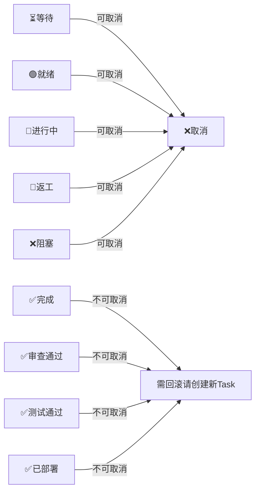

# TASK_BOARD — 多 Agent 共享任务文档规格书

> 管辖每个会话文件夹中的 TASK_BOARD.md。所有 Agent 通过它进行任务沟通和状态同步。

---

<SECTION-END:tb-6>

## 目的

TASK_BOARD.md 是多 Agent 协作的**唯一真相源**。

- Agent 只读自己的任务行，不加载整个项目上下文
- 任务状态机驱动 Agent 调度
- 上下文通过结构化表格传递，不靠 Agent 互相"猜"

---

<SECTION-END:tb-16>

## 在会话文件夹中的位置

```
docs/YYYYMMDD-描述/
├── PLAN.md            ← 静态设计（Architect 产出，冻结）
├── TASK_BOARD.md      ← 动态状态（所有 Agent 读+写）
├── SESSION_LOG.md
├── FEATURE.md
├── ADR-NNN.md
└── BUG-NNN.md
```

### 与 PLAN.md 的关系

```
PLAN.md 的 Dispatch Table（静态）
  │  含：任务 ID + 优先级 + 角色 + 依赖 + 门禁 + 超时覆写值
  ▼
TASK_BOARD.md（运行时版）
  │  继承 Dispatch Table 的静态字段
  │  增加：状态 + 上下文传递 + 故障记录 + 返工记录 + 阻塞记录（含类型）
  ▼
SESSION_LOG.md（收尾）
  │  Conductor 汇总 TASK_BOARD 最终状态
```

---

<SECTION-END:tb-44>

## 完整格式

```markdown
# 任务板

> 会话: [YYYYMMDD-描述]
> 创建: YYYY-MM-DD HH:MM（Conductor）
> 最后更新: YYYY-MM-DD HH:MM

<SECTION-END:tb-53>

<SECTION-END:tb-statuses>
## 任务状态

| ID | 优 | 任务 | 角色 | 依赖 | ⏱超时(分) | 状态 | 产出 | 原因指针 |
|----|----|------|------|------|-----------|------|------|---------|
| T01 | P2 | [任务名] | [product-analyst/architect/ui-designer/frontend-dev/backend-dev/spec-reviewer/security-auditor/quality-auditor/ux-reviewer/tester/doc-engineer] | [-] | [默认见下表] | [状态] | [文件路径] | [→段名#锚点 或 —] |

> **原因指针：** Agent 启动时顺着指针读取 docs/ 中的原始证据，自行理解"为什么在这个状态、该做什么"。Conductor 只导航，不转述。取值规则见 State Protocol「十一、原因指针」。

优先级：P0=紧急, P1=高, P2=中(默认), P3=低。Architect 在 PLAN 中设置，Conductor 复制。

默认超时：product-analyst=30, architect=120, ui-designer=60, frontend-dev=30, backend-dev=30, spec-reviewer=15, security-auditor=30, quality-auditor=20, ux-reviewer=15, tester=20, doc-engineer=10。Architect 可在 PLAN 中覆写。

<SECTION-END:tb-65>

<SECTION-END:tb-snapshot>
## 当前状态快照

| 项 | 值 |
|----|-----|
| **Git HEAD** | [commit hash] |
| **Git 脏文件** | [无 / file1.py (modified), file2.py (new)] |
| **活跃 Agent** | [无 / T-ID: 角色名] |
| **最后 Conductor 巡检** | [YYYY-MM-DD HH:MM] |

> **Conductor 职责：** 每次巡检后更新四个字段。Agent 启动时读此项，了解是否有脏 tree、是否有其他 Agent 正在执行。崩溃恢复时，新 Conductor 从此项获取代码库状态。

<SECTION-END:tb-76>

<SECTION-END:tb-context>
## 上下文传递

| 从 | 到 | 摘要 | 传递内容 |
|----|-----|------|---------|
| [T-ID] | [T-ID 列表] | [1-2句精华] | [下游需要知道的关键信息] |

<SECTION-END:tb-82>

<SECTION-END:tb-faults>
## 故障记录

| 时间 | 任务 | 类型 | 详情 |
|------|------|------|------|
| [HH:MM] | [T-ID] | 超时 | 超过 N 分钟未完成，回退🟢（第1次） |

<SECTION-END:tb-88>

<SECTION-END:tb-rework>
## 返工记录

| 任务 | 次数 | 原因 | 审查人 |
|------|------|------|--------|

<SECTION-END:tb-93>

<SECTION-END:tb-blocked>
## 阻塞

| 时间 | 任务 | 类型 | 原因 |
|------|------|------|------|
| [HH:MM] | [T-ID] | 内因/外因 | [阻塞原因] |

<SECTION-END:tb-99>

<SECTION-END:tb-reviews>
## 审查结果

> **Conductor 职责：** 审查官完成审查后，将审查结果摘记到本表。四个审查官各自一条记录。

| 时间 | 任务 | 审查官 | 档位 | 判决 | 要点 |
|------|------|--------|------|------|------|
| [HH:MM] | [T-ID] | spec-reviewer | 🔴Blocker | passed/failed | [对抗路径尝试 N 条 + 关键发现] |

> **为什么需要此段：** Tier 3（角色切换）模式下，审查报告是 Agent 上下文中的 return value — 一旦切换角色，报告内容就丢失了。必须显式落盘到 TASK_BOARD，新 Agent 才能知道「为什么返工」。

<SECTION-END:tb-109>

<SECTION-END:tb-schedule>
## Conductor 调度状态

> **Conductor 职责：** 每次派发/切换前更新本段。这是 Tier 3 的关键桥梁 — Conductor 切换角色后回来时，从这里知道自己上次做了什么决策。

| 时间 | 调度动作 | 目标 | 状态 |
|------|---------|------|------|
| [HH:MM] | 派发 T03 | backend-dev (Tier 1) | 等待结果 |
| [HH:MM] | T03 完成 → 路由审查 | spec-reviewer (Tier 1) | 审查中 |

<SECTION-END:tb-118>

<SECTION-END:tb-dispatch-log>
## 派发日志

> **Conductor 职责：** 每次派发/完成时追加一条。可审计的调度轨迹。

| 时间 | 任务 | Tier | 目标角色 | 结果 |
|------|------|------|---------|------|
| [HH:MM] | T03 | Tier 1 | backend-dev | ✅完成 (a1b2c3d) |
| [探测] | — | Tier=N | — | 会话启动探测结果 |

<SECTION-END:tb-127>

<SECTION-END:tb-agent-startup>
## Agent 启动协议

**每个 Agent（任何角色）启动时必须执行以下 Checklist。Tier 3（角色切换）尤其关键 — Agent 是空上下文进入，必须从文件重建状态。**

| # | 步骤 | 必读 | 作用 |
|---|------|:---:|------|
| 1 | 读 PROGRESS.md「当前状态」+「项目元信息」段（~500B） | ✅ | 知道这是什么项目、当前 Phase |
| 2 | 读 TASK_BOARD.md「当前状态快照」段 | ✅ | 知道 Git HEAD + 脏文件 + 活跃 Agent |
| 3 | grep 自己角色的任务行（~5行） | ✅ | 知道自己要做什么 |
| 4 | **看「原因指针」列 — 顺着指针读证据文件** | ✅ | 知道为什么在这个状态（返工原因/阻塞原因） |
| 5 | grep 上下文传递中写给自己 T-ID 的行（~3行） | ✅ | 知道上游传了什么 |
| 6 | 读铁律 + 角色合约（~2KB） | ✅ | 知道规则和禁止事项 |
| 7 | 读 `docs/knowledge/pitfalls/`（~2KB） | ✅ | 避免重复踩坑 |
| 8 | 读上游产出物文件（按需） | — | 获取具体实现细节 |

> **总上下文：~5-6KB（安全最小值）。Agent 不加载整个项目。**

> **为什么 Agent 启动协议要从「上下文隔离」提升为独立段：** 上下文隔离段描述的是设计原理，Agent 启动协议是给 Agent 的操作 Checklist。前者供框架设计者看，后者供每个 Agent 执行时逐条打勾。
```

---

<SECTION-END:tb-149>

<SECTION-END:tb-fields>
## 字段说明

### 角色

| 值 | 说明 |
|----|------|
| product-analyst | 需求分析，vibe→用户故事+验收标准 |
| architect | 架构设计，计划复盘→契约冻结 |
| ui-designer | UI 设计，视觉规范+原型 |
| frontend-dev | 前端开发，组件+交互+状态 |
| backend-dev | 后端开发，API+逻辑+数据层 |
| spec-reviewer | 规范审计，Blocker 级 |
| security-auditor | 安全审计，P0/P1/P2 分级 |
| quality-auditor | 质量审计，DB+性能合并，Advisory |
| ux-reviewer | 体验审计，还原度+无障碍，Advisory |
| tester | 测试，Hard Gate |
| doc-engineer | 文档归档，增量+阶段整合 |

### 状态

| 状态 | 含义 | 谁设置 |
|------|------|--------|
| ⏳ 等待 | 上游未完成，不可开始 | Conductor（初始化） |
| 🟢 就绪 | 依赖全满足，可以领取 | Conductor（自动 promote） |
| 🔨 进行中 | Agent 正在执行 | Agent（领取时） |
| ✅ 完成 | Agent 完成 | Agent（完成时） |
| ✅ 审查通过 | Reviewer 审查通过 | Reviewer |
| 🔄 返工 | 审查不通过，退回重做 | Reviewer |
| ❌ 阻塞 | 需人工介入 | Conductor |
| ❌ 取消 | 任务被废弃，不再执行 | Conductor |
| ✅ 测试通过 | Tester 验证通过 | Tester |
| ✅ 已部署 | Doc Engineer 归档完成 | Doc Engineer |

### 优先级

| 值 | 含义 | 使用场景 |
|----|------|---------|
| P0 | 紧急 | 阻塞其他任务的关键路径，优先领取 |
| P1 | 高 | 核心功能 |
| P2 | 中（默认） | 常规任务 |
| P3 | 低 | 锦上添花，可延后 |

Agent 面对多个 🟢就绪 任务时，按优先级排序，同优先级任意选择。

#<SECTION-END:tb-blocked>
## 阻塞类型

| 值 | 含义 | 谁来解 | Conductor 行为 |
|----|------|--------|---------------|
| 内因 | 代码/设计问题 | 修改代码（返工/拆分/修复） | 人工手动解除 |
| 外因 | 等待外部资源 | 等外部就绪（API key、服务开通、第三方） | 定期检查，条件满足后自动解除 |

---

<SECTION-END:tb-202>

<SECTION-END:tb-lifecycle>
## 生命周期

```
project-bootstrap
  │  创建空的 TASK_BOARD.md（只有标题）
  ▼
Phase 1: Product Analyst → Architect
  │  Product Analyst: vibe→用户故事+验收标准+风险标签
  │  Architect: 计划复盘（设计理解书→用户确认）→ API契约冻结+Plan
  │  UI Designer (有界面时): 视觉规范+原型
  ▼
Conductor 初始化 TASK_BOARD.md
  │  从 PLAN.md 的 Dispatch Table 提取任务行
  │  所有任务初始状态 = ⏳ 等待
  │  无依赖任务 = 🟢 就绪（Frontend Dev + Backend Dev 可并行领取）
  ▼
Conductor 自动 promote
  │  每次任务完成后检查：依赖全满足的 → ⏳ → 🟢
  ▼
每个 Dev 执行循环:
  1. 读 TASK_BOARD → 找自己角色 + 🟢 就绪的行
  2. 读「上下文传递」中写给自己的段
  3. 读角色合约 + 铁律（固定上下文）
  4. 执行任务（TDD: Red→Green→Refactor）
  5. 更新状态 🔨→✅
  6. 写「上下文传递」给下游
  7. 如遇 Bug → 创建 BUG-NNN.md
  8. ≥2次修复失败 → 进入 Debug 模式（诊断协议包）
  ▼
Conductor 巡检（持续）:
  │  检查所有 🔨 任务是否超时
  │  超时 → 🔨→🟢 + 故障记录
  │  同任务 3 次超时 → ❌阻塞
  │  更新「当前状态快照」（Git HEAD / 脏文件 / 活跃 Agent / 巡检时间）
  │  任务终态时 → 立即更新 SESSION_LOG「任务完成情况」表
  ▼
质量层 4 审查官并行:
  ├── Spec Reviewer: 🔴 Blocker，对照验收标准+API契约
  ├── Security Auditor: 🔴 Blocker，按 P0/P1/P2 分级
  ├── Quality Auditor: 🟢 Advisory，DB+性能，🟠 ≥3→升级
  └── UX Reviewer: 🟢 Advisory，还原度，有界面时触发
      任意 Blocker → 通知其他审查官暂停 → 解决后断点恢复
  ▼
Tester:
  1. 所有 🔴 Blocker 已解决
  2. 🟡 Hard Gate — 全量测试 PASS
  3. 失败 → 按类型路由修复回路
  ▼
修复回路:
  仅逻辑错误 → 回 Dev → Tester
  涉及接口/权限 → 回 Architect + Spec + Security
  涉及依赖/数据 → 回 Architect + Spec + Quality
  ▼
Doc Engineer:
  增量: 合入主干时异步更新 API/数据/配置/依赖文档
  阶段: Milestone 结束 → 概览图+索引+一致性检查
  ▼
任意阶段 — 取消:
  用户指令 → Conductor 标记任务为 ❌取消
  → 通知执行中的 Agent 中止
  → 直接下游标为 ❌阻塞（原因：上游已取消）
  → 等待人工决策
  ▼
Conductor 收尾:
  1. 全部任务终态 + Tester 全绿 + Doc Engineer 归档完成
  2. SESSION_LOG「完成」「决策」「踩坑」「产出物」段汇总（任务表已渐进填写）
  3. 有未完成 → PROGRESS 标记「未完成，续接至下一会话」
  ▼
  3. PROGRESS.md 移至历史会话（全部终态）/ 保持当前（有未完成任务）
  ▼
[如有未完成任务 → 下一会话]
  新 Conductor 执行崩溃检测 → 读旧 TASK_BOARD（优先）→ 继承未完成任务 → 初始化新 TASK_BOARD
```

---

<SECTION-END:tb-278>

<SECTION-END:tb-context>
<SECTION-END:tb-context-rules>
## 上下文传递规则

### 格式要求

| 从 | 到 | 摘要 | 传递内容 |
|----|-----|------|---------|
| T01 | T02,T03,T04 | JWT认证 + User模型 + bcrypt决策 | API: RESTful+JWT。模型: User(email,password_hash)。决策: ADR-001 |

> **一行一条上下文，Agent 可以 grep 自己的 T-ID 精确定位。摘要列提供 1-2 句精华，Agent 不需要解析传递内容即可快速判断是否需要深入阅读。**

### 不同角色传什么

| 上游角色 | 下游角色 | 必传内容 |
|---------|---------|---------|
| product-analyst | architect | 用户故事 + 验收标准 + 风险标签 |
| architect | frontend-dev / backend-dev | API 契约（freeze）+ 数据模型 + 关键决策（ADR 编号） |
| ui-designer | frontend-dev | 视觉规范 + 原型文件路径 |
| backend-dev | frontend-dev | 接口签名、请求/响应格式、端点列表 |
| frontend-dev | backend-dev | 所需 API 格式变更（如需） |
| frontend-dev / backend-dev | spec-reviewer | 产出文件路径、接口签名 |
| frontend-dev / backend-dev | security-auditor | 产出文件路径、权限模型 |
| frontend-dev / backend-dev | tester | API 签名、边界条件建议 |
| reviewer* | tester | 审查结果、重点关注项、已知风险点 |

### 禁止

- ❌ 传完整代码（Agent 自己去读文件）
- ❌ 传个人理解（只传事实：文件路径、接口签名）
- ❌ 传废话（如"做得很好"、"继续加油"）

---

<SECTION-END:tb-310>

<SECTION-END:tb-rework-rules>
## 返工规则

```
Agent 完成 → ✅ 完成
    ↓ Reviewer 审查
    ├─ 通过 → ✅审查通过 → 下游 🟢就绪
    └─ 不通过 → 🔄返工
         ├─ 1~2 次 → 原 Agent 改（附审查意见）
         └─ ≥ 3 次 → ❌阻塞 → Conductor 通知用户
```

返工不覆盖原始状态行，记录在「返工记录」表中。

---

<SECTION-END:tb-325>

<SECTION-END:tb-cancel-rules>
## 取消规则



### 可取消的状态
任务在以下任意状态时，Conductor 都可以将其标为 ❌取消：

| 状态 | 取消时的处理 |
|------|-------------|
| ⏳等待 | 直接从队列移除 |
| 🟢就绪 | 不执行 |
| 🔨进行中 | 通知 Agent 中止；Agent 应丢弃未提交的工作 |
| 🔄返工 | 放弃返工 |
| ❌阻塞 | 放弃等待（不再恢复） |

**注意**：Agent 已经 commit 的代码不会自动 revert，由用户另行处理。

### 不可取消的状态
`✅完成`、`✅审查通过`、`✅测试通过`、`✅已部署` — 代码已产出，取消无意义。如需撤销，请创建新的回滚 Task。

### 级联规则
**不自动级联取消下游任务。** 被取消任务的直接下游任务由 Conductor 标记为 ❌阻塞，原因=`上游 TXX 已取消`。留给人工决策：改依赖、重新分配、或也取消。

### 取消记录
取消事件写入「阻塞」表（与阻塞共用），原因列明：

> `T03 取消 — 用户决定不做 XX 功能`

---

<SECTION-END:tb-366>

<SECTION-END:tb-timeout-rules>
## 超时回退规则

### 触发条件
Conductor 定期巡检 TASK_BOARD，检查所有 `🔨进行中` 的任务：
- 从任务进入 `🔨` 的时间开始计时
- 超过该任务的 `⏱超时(分)` → 触发回退

### 回退流程

```
🔨进行中 ─── 超过超时 ──→ 🟢就绪（回退，新 Agent 可领取）
                │
                ├─ 写入「故障记录」表（类型=超时，第N次）
                │
                └─ 同任务累计 ≥3 次超时 ──→ ❌阻塞
                    原因：连续超时，可能任务过大或环境异常，等待人工介入
```

### 回退意味着什么
- 🟢就绪 → 任务重新进入队列，任何同角色 Agent 可以领取
- 铁律 Ⅴ 保证上下文隔离：新 Agent 从零读 spec + 上游产出物，不受前一个 Agent 影响
- 旧 Agent 的未提交工作（文件修改、脏 git 状态）在回退时**不清理** → 新 Agent 启动时自动检测并提示

### 默认超时

| 角色 | 默认超时(分) | 理由 |
|------|-------------|------|
| product-analyst | 30 | 需求澄清应快速 |
| architect | 120 | 设计需要思考时间 |
| ui-designer | 60 | 原型产出中等 |
| frontend-dev | 30 | 一个 Task 不应超过半小时 |
| backend-dev | 30 | 一个 Task 不应超过半小时 |
| spec-reviewer | 15 | 对照验收标准审查 |
| security-auditor | 30 | P0 全量审计需时间 |
| quality-auditor | 20 | DB+性能检查 |
| ux-reviewer | 15 | 对比原型审查 |
| tester | 20 | 测试执行 + 分析 |
| doc-engineer | 10 | 增量归档应快速 |

Architect 可在 PLAN.md 的 Dispatch Table 中为个别 Task 覆写超时值。

---

<SECTION-END:tb-409>

<SECTION-END:tb-cross-session>
## 跨会话继承规则

### 场景
一个功能跨越多个会话（如分 3 天完成）。每个会话有自己的 `docs/YYYYMMDD-描述/` 文件夹和独立的 TASK_BOARD.md。

### 继承流程

```
Session N 结束                          Session N+1 开始
══════════════                          ═══════════════

TASK_BOARD.md (冻结归档)                新 TASK_BOARD.md
  T01 ✅完成                            T03 🟢就绪（重置 + 依赖已满足）
  T02 ✅完成                            T04 ⏳等待（依赖 T03）
  T03 🔨进行中 ← 中断！                  T05 🟢就绪（新增任务）
  T04 ⏳等待
  T05 — (本次未开始)

SESSION_LOG.md                         Conductor 继承逻辑（TASK_BOARD 优先）:
  T01 ✅测试通过       ────────→         1. 读上一个 Session 的 **TASK_BOARD.md**
  T02 ✅完成                               （唯一真相源，不依赖 SESSION_LOG）
  T03 🔨进行中                          2. 提取非终态任务 → 新 TASK_BOARD
  T04 ⏳等待                            3. 读 SESSION_LOG「任务完成情况」表
  T05 —                                   （兜底/补充 — 获取已完成任务的简述/决策/产出/Commit）
                                         4. 重置状态 + 重算依赖
                                         5. 复制相关「上下文传递」行
                                         6. 如果 TASK_BOARD 不存在 → 回退用 SESSION_LOG（降级路径）

PROGRESS.md                            PROGRESS.md
  当前会话: Session N     ────────→      当前会话: Session N+1
```

### 状态重置规则

| 旧会话中的状态 | 新会话中的状态 | 说明 |
|--------------|--------------|------|
| ✅完成 / ✅审查通过 / ✅测试通过 / ✅已部署 | **不继承** | 已完成，不在新 TASK_BOARD 中出现 |
| 🔨进行中 | 🟢就绪 | 中断了，重新入队 |
| 🔄返工 | 🟢就绪 | 返工中断，从头来 |
| ⏳等待 | ⏳等待 | 仍然等上游 |
| ❌阻塞 | ❌阻塞 | 阻塞未解除 |
| ❌取消 | ❌取消 | 已废弃 |

已完成的任务不出现在新 TASK_BOARD 中，但它们的产出物（文件路径、上下文传递）会被继承。

### 依赖重算

1. 旧会话中已完成的任务 → 其下游依赖在新会话中**视为满足**
2. Conductor 重算：去掉已满足的依赖，只保留"依赖指向未完成任务"的依赖
3. 无依赖的未完成任务 → 直接设为 🟢就绪

示例：
```
旧会话:  T01✅ → T02✅ → T03⏳ → T04⏳
新会话:  去掉 T01, T02
         T03 依赖 T02 → T02 已完成 → 依赖满足 → T03🟢
         T04 依赖 T03 → T03 未完成 → 保留依赖 → T04⏳
```

#<SECTION-END:tb-context>
## 上下文传递继承

Conductor 从旧会话复制所有**到字段包含未完成任务 ID** 的上下文传递行：

```
旧会话上下文传递:
  T01 → T03: API签名 + 端点列表   ← 复制（T03 是未完成任务）
  T01 → T02: 数据模型              ← 不复制（T02 已完成）
  T02 → T04: 接口格式              ← 复制（T04 是未完成任务）
```

### 新增任务
新会话可能需要新增任务（如功能扩展）。这些任务：
- 分配新 Task ID（接续旧 ID 递增）
- 按正常流程加入 Dispatch Table 和 TASK_BOARD
- 可以依赖旧会话未完成的任务、或全新任务

---

<SECTION-END:tb-487>

<SECTION-END:tb-isolation>
## 上下文隔离机制

Agent 启动时**不加载整个项目**，但必须加载**最小安全上下文**：

```
1. 读 PROGRESS.md「当前状态」+「项目元信息」段（~500B）      ← 必读
   作用: 知道这是什么项目、技术栈、当前 Phase
2. 读 TASK_BOARD.md「当前状态快照」段                      ← 必读
   作用: 知道 Git HEAD、有没有脏 tree、有没有活跃 Agent
3. grep TASK_BOARD.md → 自己角色的行（~5 行）
4. grep 上下文传递 → 自己 T-ID 的行（~3 行）
5. 读铁律 + 角色合约（固定 ~2KB）
6. 读 pitfalls.md（~2KB）                                ← 必读，避免重复踩坑
7. 读上游产物文件（按需）

总上下文: ~5-6KB（安全最小值）
```

> **为什么必须读 pitfalls.md？** 上下文隔离不意味着让 Agent 裸奔。已知陷阱库是项目最宝贵的知识——不让 Agent 读它等于让每个新 Agent 重新踩一遍所有坑。

> **为什么不读完整 PROGRESS？** 只读「当前状态」+「项目元信息」段（~500B），不读功能清单/历史会话/下一步（这些是 Conductor 用的）。

---

<SECTION-END:tb-511>

<SECTION-END:tb-roles>
## 各角色职责

| 角色 | 读 | 写 |
|------|-----|-----|
| Conductor | 全部 | 初始化任务行、promote 状态、写阻塞/审查结果/调度状态/派发日志/原因指针、注入诊断包、更新当前状态快照、渐进更新 SESSION_LOG、写 Events |
| Product Analyst | 用户需求 | 用户故事+验收标准+风险标签 |
| Architect | 用户故事+验收标准 | Plan+API契约+数据模型 |
| UI Designer | 用户故事+API契约 | 视觉规范+原型 |
| Frontend Dev | 自己角色+🟢就绪的行 + 上下文 | 状态、上下文传递 |
| Backend Dev | 自己角色+🟢就绪的行 + 上下文 | 状态、上下文传递 |
| Spec Reviewer | ✅完成的行 + 验收标准 | 状态、返工记录 |
| Security Auditor | ✅完成的行 | Blocker/通过（按风险等级） |
| Quality Auditor | ✅完成的行 | Advisory 报告 |
| UX Reviewer | ✅完成的行 + UI原型 | Advisory 报告 |
| Tester | 所有审查通过的行 | 状态、Bug 记录 |
| Doc Engineer | 会话所有产出物 | 增量归档+阶段整合 |

---

<SECTION-END:tb-530>

<SECTION-END:tb-concurrency>
## 并发写入注意事项

TASK_BOARD.md 是纯文本文件，多个 Agent 同时写入可能导致覆盖。

### 实际风险分析
- 依赖关系使大部分任务是**顺序执行**的（上游完成 → 下游才开始）
- 真正并行的只有互不依赖的任务 —— 此时它们写入的是**不同的任务行**
- 上下文传递、返工记录、故障记录、阻塞是**只追加不修改**的 → 天然并发安全

### 防御措施（三层）

| 层 | 措施 | 说明 |
|----|------|------|
| **结构层** | 追加型表格不修改已有行 | 上下文传递、返工、故障、阻塞 — Agent 只 `>>` 追加 |
| **验证层** | Agent 写入后重读验证 | 写完立即 `grep` 自己的任务行，确认状态已变更；未落地则重试 |
| **兜底层** | Conductor 巡检发现不一致 | 巡检时检查：上下文传递引用的 T-ID 状态是否匹配；不匹配则修复 |

### Agent 写入 Checklist

```
1. 读取 TASK_BOARD.md 完整内容
2. 修改自己的任务行（🔨→✅）
3. 追加上下文传递行
4. 写入文件
5. 立即重读 → grep 自己的任务行 → 确认状态 = ✅
6. 如果未落地 → 等待 2 秒 → 重新执行步骤 4-5
7. 如果 3 次重试仍未落地 → 报告 Conductor（可能并发冲突）
```

<SECTION-END:tb-final>

<SECTION-END:tb-final>
