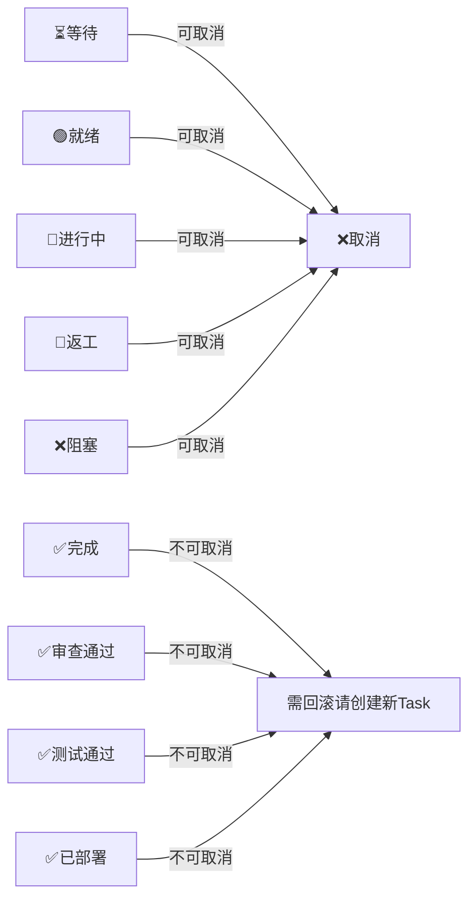

# TASK_BOARD — 多 Agent 共享任务文档规格书

> 管辖每个会话文件夹中的 TASK_BOARD.md。所有 Agent 通过它进行任务沟通和状态同步。

---

## 目的

TASK_BOARD.md 是多 Agent 协作的**唯一真相源**。

- Agent 只读自己的任务行，不加载整个项目上下文
- 任务状态机驱动 Agent 调度
- 上下文通过结构化表格传递，不靠 Agent 互相"猜"

---

## 在会话文件夹中的位置

```
docs/YYYYMMDD-描述/
├── PLAN.md            ← 静态设计（Architect 产出，冻结）
├── TASK_BOARD.md      ← 动态状态（所有 Agent 读+写）
├── SESSION_LOG.md
├── FEATURE.md
├── ADR-NNN.md
└── BUG-NNN.md
```

### 与 PLAN.md 的关系

```
PLAN.md 的 Dispatch Table（简化版）
  │  含：任务 ID + 角色 + 依赖 + 门禁
  ▼
TASK_BOARD.md（运行时版）
  │  继承 Dispatch Table 的静态字段
  │  增加：状态 + 上下文传递 + 返工记录 + 阻塞记录
  ▼
SESSION_LOG.md（收尾）
  │  Conductor 汇总 TASK_BOARD 最终状态
```

---

## 完整格式

```markdown
# 任务板

> 会话: [YYYYMMDD-描述]
> 创建: YYYY-MM-DD HH:MM（Conductor）
> 最后更新: YYYY-MM-DD HH:MM

## 任务状态

| ID | 任务 | 角色 | 依赖 | ⏱超时(分) | 状态 | 产出 |
|----|------|------|------|-----------|------|------|
| T01 | [任务名] | [architect/coder/reviewer/tester/devops] | [-] | [默认见下表] | [状态] | [文件路径] |

默认超时：architect=120, coder=30, reviewer=15, tester=20, devops=15。Architect 可在 PLAN 中覆写。

## 上下文传递

| 从 | 到 | 传递内容 |
|----|-----|---------|
| [T-ID] | [T-ID 列表] | [下游需要知道的关键信息] |

## 故障记录

| 时间 | 任务 | 类型 | 详情 |
|------|------|------|------|
| [HH:MM] | [T-ID] | 超时 | 超过 N 分钟未完成，回退🟢（第1次） |

## 返工记录

| 任务 | 次数 | 原因 | 审查人 |
|------|------|------|--------|

## 阻塞

| 时间 | 任务 | 原因 |
|------|------|------|
| T03 取消 — 用户决定不做 XX 功能 |
```

---

## 字段说明

### 角色

| 值 | 说明 |
|----|------|
| architect | 架构设计 |
| coder | 代码实现 |
| reviewer | 代码审查 |
| tester | 测试 |
| devops | 部署/CI |

### 状态

| 状态 | 含义 | 谁设置 |
|------|------|--------|
| ⏳ 等待 | 上游未完成，不可开始 | Conductor（初始化） |
| 🟢 就绪 | 依赖全满足，可以领取 | Conductor（自动 promote） |
| 🔨 进行中 | Agent 正在执行 | Agent（领取时） |
| ✅ 完成 | Agent 完成 | Agent（完成时） |
| ✅ 审查通过 | Reviewer 审查通过 | Reviewer |
| 🔄 返工 | 审查不通过，退回重做 | Reviewer |
| ❌ 阻塞 | 需人工介入 | Conductor |
| ❌ 取消 | 任务被废弃，不再执行 | Conductor |
| ✅ 测试通过 | Tester 验证通过 | Tester |
| ✅ 已部署 | DevOps 部署就绪 | DevOps |

---

## 生命周期

```
project-bootstrap
  │  创建空的 TASK_BOARD.md（只有标题）
  ▼
Phase 1: Architect 产出 PLAN.md
  │
  ▼
Conductor 初始化 TASK_BOARD.md
  │  从 PLAN.md 的 Dispatch Table 提取任务行
  │  所有任务初始状态 = ⏳ 等待
  │  无依赖任务 = 🟢 就绪
  ▼
Conductor 自动 promote
  │  每次任务完成后检查：依赖全满足的 → ⏳ → 🟢
  ▼
每个 Agent 执行循环:
  1. 读 TASK_BOARD → 找自己角色 + 🟢 就绪的行
  2. 读「上下文传递」中写给自己的段
  3. 读角色合约 + 铁律（固定上下文）
  4. 执行任务
  5. 更新状态 🔨→✅
  6. 写「上下文传递」给下游
  7. 如遇 Bug → 创建 BUG-NNN.md
  ▼
Conductor 巡检（持续）:
  │  检查所有 🔨 任务是否超时
  │  超时 → 🔨→🟢 + 故障记录
  │  同任务 3 次超时 → ❌阻塞
  ▼
Reviewer 审查:
  1. 读 ✅ 完成的行
  2. Spec Review + Quality Review
  3. 通过 → ✅审查通过
  4. 不通过 → 🔄 返工（写返工记录）
  ▼
Tester 测试:
  1. 读 ✅审查通过 的行
  2. 集成测试
  3. 通过 → ✅测试通过
  4. 不通过 → 🔄 返工
  ▼
DevOps 部署:
  1. 读 ✅测试通过 的行
  2. CI/CD 配置检查 + 部署就绪验证
  3. 通过 → ✅已部署
  4. 不通过 → 🔄 返工（注明缺失项）
  ▼
任意阶段 — 取消:
  用户指令 → Conductor 标记任务为 ❌取消
  → 通知执行中的 Agent 中止
  → 直接下游标为 ❌阻塞（原因：上游已取消）
  → 等待人工决策
  ▼
Conductor 收尾:
  1. 全部任务处于终态（✅/❌取消/❌阻塞）→ 更新 SESSION_LOG.md
  2. PROGRESS.md 移至历史会话
```

---

## 上下文传递规则

### 格式要求

| 从 | 到 | 传递内容 |
|----|-----|---------|
| T01 | T02,T03,T04 | API: RESTful+JWT。模型: User(email,password_hash)。决策: ADR-001 |

> **一行一条上下文，Agent 可以 grep 自己的 T-ID 精确定位。**

### 不同角色传什么

| 上游角色 | 下游角色 | 必传内容 |
|---------|---------|---------|
| architect | coder | API 风格、数据模型、关键决策（ADR 编号） |
| coder（上游） | coder（下游） | 接口签名、请求/响应格式、端点列表 |
| coder | reviewer | 产出文件路径、接口签名 |
| reviewer | tester | 审查结果、重点关注项、已知风险点 |
| coder | tester | API 签名、边界条件建议 |

### 禁止

- ❌ 传完整代码（Agent 自己去读文件）
- ❌ 传个人理解（只传事实：文件路径、接口签名）
- ❌ 传废话（如"做得很好"、"继续加油"）

---

## 返工规则

```
Agent 完成 → ✅ 完成
    ↓ Reviewer 审查
    ├─ 通过 → ✅审查通过 → 下游 🟢就绪
    └─ 不通过 → 🔄返工
         ├─ 1~2 次 → 原 Agent 改（附审查意见）
         └─ ≥ 3 次 → ❌阻塞 → Conductor 通知用户
```

返工不覆盖原始状态行，记录在「返工记录」表中。

---

## 取消规则



### 可取消的状态
任务在以下任意状态时，Conductor 都可以将其标为 ❌取消：

| 状态 | 取消时的处理 |
|------|-------------|
| ⏳等待 | 直接从队列移除 |
| 🟢就绪 | 不执行 |
| 🔨进行中 | 通知 Agent 中止；Agent 应丢弃未提交的工作 |
| 🔄返工 | 放弃返工 |
| ❌阻塞 | 放弃等待（不再恢复） |

**注意**：Agent 已经 commit 的代码不会自动 revert，由用户另行处理。

### 不可取消的状态
`✅完成`、`✅审查通过`、`✅测试通过`、`✅已部署` — 代码已产出，取消无意义。如需撤销，请创建新的回滚 Task。

### 级联规则
**不自动级联取消下游任务。** 被取消任务的直接下游任务由 Conductor 标记为 ❌阻塞，原因=`上游 TXX 已取消`。留给人工决策：改依赖、重新分配、或也取消。

### 取消记录
取消事件写入「阻塞」表（与阻塞共用），原因列明：

> `T03 取消 — 用户决定不做 XX 功能`

---

## 超时回退规则

### 触发条件
Conductor 定期巡检 TASK_BOARD，检查所有 `🔨进行中` 的任务：
- 从任务进入 `🔨` 的时间开始计时
- 超过该任务的 `⏱超时(分)` → 触发回退

### 回退流程

```
🔨进行中 ─── 超过超时 ──→ 🟢就绪（回退，新 Agent 可领取）
                │
                ├─ 写入「故障记录」表（类型=超时，第N次）
                │
                └─ 同任务累计 ≥3 次超时 ──→ ❌阻塞
                    原因：连续超时，可能任务过大或环境异常，等待人工介入
```

### 回退意味着什么
- 🟢就绪 → 任务重新进入队列，任何同角色 Agent 可以领取
- 铁律 Ⅴ 保证上下文隔离：新 Agent 从零读 spec + 上游产出物，不受前一个 Agent 影响
- 旧 Agent 的未提交工作（文件修改、脏 git 状态）在回退时**不清理** → 新 Agent 启动时自动检测并提示

### 默认超时

| 角色 | 默认超时(分) | 理由 |
|------|-------------|------|
| architect | 120 | 设计需要思考时间 |
| coder | 30 | 一个 Task 不应超过半小时 |
| reviewer | 15 | 审查应快速 |
| tester | 20 | 测试执行 + 分析 |
| devops | 15 | 部署检查应快速 |

Architect 可在 PLAN.md 的 Dispatch Table 中为个别 Task 覆写超时值。

---

## 上下文隔离机制

Agent 启动时**不加载整个项目**，而是：

```
1. grep TASK_BOARD.md → 自己角色的行（~5 行）
2. grep 上下文传递 → 自己 T-ID 的行（~3 行）
3. 读铁律 + 角色合约（固定 ~2KB）
4. 读上游产物文件（按需）

总上下文: ~2-3KB（而非全项目 50KB+）
```

---

## 各角色职责

| 角色 | 读 | 写 |
|------|-----|-----|
| Conductor | 全部 | 初始化任务行、promote 状态、写阻塞 |
| Coder | 自己角色+🟢就绪的行 + 上下文 | 状态、上下文传递 |
| Reviewer | ✅完成的行 + 上下文 | 状态、返工记录 |
| Tester | ✅审查通过的行 + 上下文 | 状态 |
| DevOps | ✅测试通过的行 + 上下文 | 状态 |
