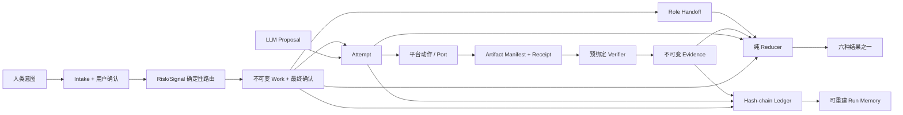

# Yuan vNext 架构

## 一句话模型

Yuan 是包裹 Agent 平台的最小确定性控制内核：LLM 提出候选，平台执行动作，不可变 Record 保存事实，预绑定 Verifier 生成 Evidence，纯 Reducer 给出结果。



## 权威模型

系统只有三类权威：

1. 人类选择已发布的 Protocol/Kernel，并定义 Work。
2. Kernel 验证 Record、Grant、Budget、副作用和 Evidence。
3. Verifier 证明具体 Acceptance Criterion 对应的事实。

LLM 从来不是上述权威。`AGENTS.md` 只是帮助 LLM 进入协议的 Adapter 指令。

运行中的 Kernel 只对当前 Run 有权威，无权批准或否决其继任版本。这样既消除了“旧规则批准新规则”的循环，又不允许候选版本静默替换当前 Run 已固定的版本。

## 模块边界

| Module | 机械职责 |
|---|---|
| `canonical.py` | 唯一 Canonical JSON 编码与 SHA-256 Identity |
| `primitives.py` | Identifier、SHA-256 与断言的唯一共享校验原语 |
| `paths.py` | Relative Path 约束与 Scope 匹配 |
| `validate.py` | Work、Proposal、Evidence、Grant 与 Binding 语义 |
| `workflow.py` | Intake/Work Confirmation、Routing 与 Role Handoff 语义 |
| `artifacts.py` | 有界稳定枚举、Manifest 与 Diff |
| `ledger.py` | 不可变 Event/Blob、Hash Chain、Atomic Head 与恢复 |
| `runtime.py` | Work/Attempt/Evidence 生命周期与确定性 Replay |
| `memory.py` | Work/Evidence 绑定的追加式长期记忆、检索与可重建索引 |
| `reducer.py` | 纯六结果判定 |
| `identity.py` | 已安装 Protocol、Kernel 与 Environment Binding |
| `ports.py` | 供受控平台接入的物理副作用中介边界，不计入纯状态 Kernel |
| `cli.py` | 只做 JSON Adapter，不引入第二套语义 |

Core 只使用 Python 标准库。发行物可以是单个 `yuan.pyz`，不要求 Daemon、Database、Scheduler 或平台服务。

Conformance 对职责层分别设置 Design Review 阈值：纯状态 Core 2,000 行、Deployment/Release 1,000 行、Capability/CLI 1,200 行、Platform Port 250 行、Long-term Memory 400 行；新增模块未归类会直接失败。预算是架构审查门槛，不把平台边界或部署代码混算成 Core。

项目安装器属于 Deployment Adapter。首次安装仍验证 Candidate Release；`update` 则从 Yuan Source 外部强制重建托管框架，不依赖旧 Runtime、版本、Install Record、Active Work 或 Conformance，也不保留旧框架。更新唯一必须保持的是 `.yuan-run/`、`docs/memory/`、Custom Extension 与项目自有内容；新 Runtime 状态失败只产生诊断，不触发旧 Runtime 回滚。最新 Runtime 读取历史 Schema 是发行兼容性不变量。

## Profile 保证等级

| 能力 | GUIDED | AUDITED | ENFORCED |
|---|---:|---:|---:|
| Protocol 引导 | 是 | 是 | 是 |
| 不可变 Ledger/Replay | 是 | 是 | 是 |
| 预绑定 Verifier 执行 | 是 | 是 | 是 |
| 未声明 Artifact 修改检测 | 不承诺 | 是 | 是 |
| 物理副作用中介 | 否 | 否 | 是 |

参考实现提供 `GUIDED` 与 `AUDITED`。在安装符合规范的 Action Port 前，配置会拒绝宣称 `ENFORCED`。

## Record 拓扑

```text
.yuan/
  config.json                 Profile 与不可变 Binding
  protocol.md                 固定的 Protocol Bytes
.yuan-run/
  current.json                可替换 Run Pointer
  blobs/sha256/aa/bb...       内容寻址 Receipt/Manifest
  runs/<run-id>/
    events/00000001-<sha>.json
    head.json                 可恢复的 Hash-chain Pointer
    run-memory.json           一次性 Projection
docs/memory/
  records/<kind>/<id>/        不可变 Memory Revision
  index.json                  可重建机器索引
  INDEX.md                    可重建人类视图
```

Work、Attempt Transition、Evidence 与 Result 都是 Ledger Event。Artifact Manifest 与 Tool Receipt 是 Blob。Head 和 Run Memory 是 Projection；丢失它们不会破坏权威历史。长期 Memory 不是 Core Result，而是由 Work/Evidence 支持、可提交 Git 的语义知识；旧 Revision 不覆盖，文件 Binding 变化会标记 stale。

每个外部状态命令都对当前 Artifact 至少执行一次内容哈希。Runtime 在一次命令内只读取并回放 Ledger 一次，Attempt 转换复用该次审计得到的 Manifest，避免 begin/dispatch/observe 在同一状态转换中重复扫描仓库。Ledger Append Lock 记录持有 PID：已退出进程遗留的锁可自动回收，仍存活的持有者继续受互斥保护。

## 标准 AUDITED 生命周期

1. `yuan init` 固定 Protocol、Kernel、Environment 与 Profile。
2. `yuan intake template/check/confirm` 固定问题、答案、假设、风险和第一次用户确认。
3. `yuan capability route` 从 Risk/Signal 生成唯一 Agent→Skill Assignment。
4. `yuan work template/bind-verifier/confirm` 创建完整契约并绑定第二次用户确认。
5. `yuan work accept` 验证 Confirmation/Routing/Verifier 并固定初始 Artifact。
6. `yuan attempt begin/dispatch/observe` 验证并审计一个有界副作用。
7. `yuan verify` 运行预绑定只读 Verifier并创建 Evidence。
8. 每个 Routing 角色通过 `handoff template/record` 记录 `READY` 或 `NEEDS_WORK`。
9. Memory Curator 追加长期 Memory，或记录有证据理由的 `NO_MEMORY_CHANGE` Handoff。
10. `yuan reduce` 仅在 Evidence、Side Effect 与 Required Handoff 全部满足时派生 `COMPLETE`。

用户中途改变契约时，`run supersede` 关闭旧 Work，Successor 从新 Intake 和两次确认重新开始；历史不被覆盖。

## 安全声明

`AUDITED` 是开放 Agent 平台上的 Detective/Corrective Harness。它能检测 Out-of-band Artifact 修改并使陈旧 Evidence 失效，但 Verifier 审计钩子不是恶意代码沙箱，也不能认证 `.yuan-run` 是否被拥有任意写权限的恶意进程重写。`ENFORCED` 需要平台或 OS 隔离；它是更强的部署 Profile，不是 Prompt 声明。

## 工程能力层

Core 只定义确定性语义，不承担全部软件工程知识。发行包默认携带 `vibe-coding` Capability Profile：Rules 约束工作纪律，Agents 隔离职责，Skills 提供按需流程。它们只能帮助编写 Work/Proposal、指导动作或生成 Evidence，不能增加 Primitive、Result 或修改 `COMPLETE` 谓词。

托管能力逐文件绑定到 Capability Manifest 和 Install Record；强制更新直接用当前发行包替换该托管集合。每个 Bundled Profile 通过 `profile.json` 自描述；其 Workflow 同时定义 Risk Route、Signal Route、Agent→Skill Assignment 和 Artifact Reviewer。Runtime 的 `capability route` 机械生成唯一 Work Routing，`list/resolve` 负责发现与按需加载。

项目能力位于 `.yuan/extensions/custom/<extension-id>/`，不进入框架托管集合。Custom Descriptor 自绑定逐文件 Digest；损坏的自定义扩展被隔离并报告，不会使 Core 或托管 Profile 成为隐藏依赖。
